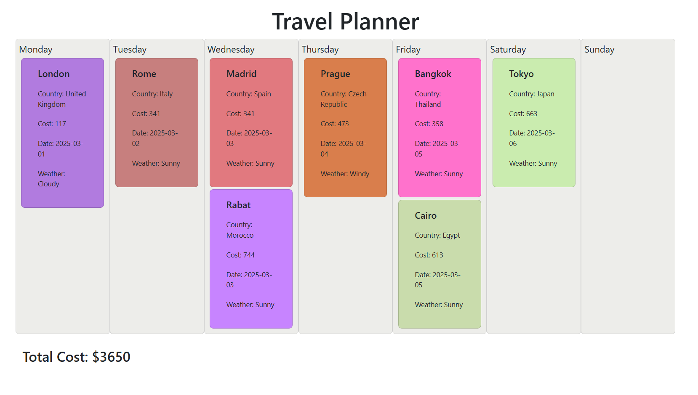

# Travel Planner

It's a simple web application for planning trips. It's written in JavaScript. It uses Redux for state management.

---

## Technologies used:

- HTML
- CSS (Bootstrap 5)
- JavaScript, AJAX
- Redux

---

